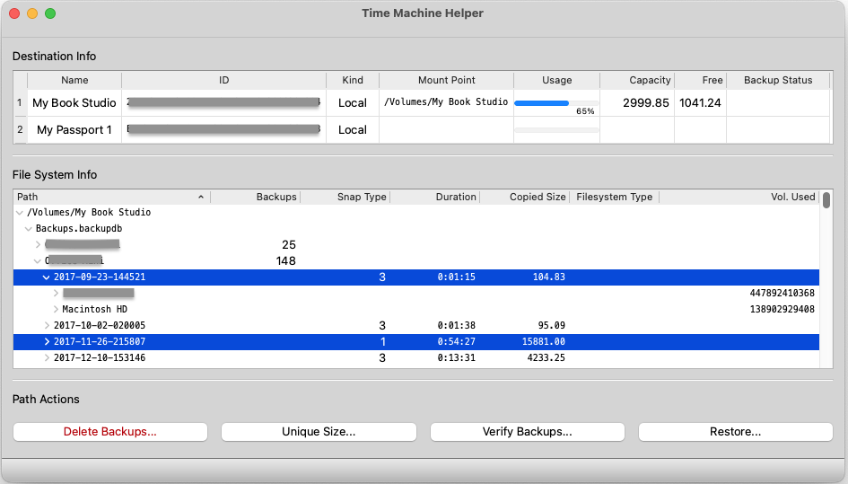

# Time Machine Helper

A Qt based GUI application for helping with macOS Time Machine.
This is a macOS specific application.

## Features



- [x] Monitoring of destinations configured for use with Time Machine.
- [x] Backup status monitoring showing backup phase, percentage completion, and more.
- [x] Inspection of mount point paths, their _backup stores_, _machine directories_, _backups_, _volume stores_, and their directories and files, showing snapshot types, copied sizes, file system types, and volume used data sizes.
- [x] Deletion of _backups_, an administrative action.
- [x] "Uniquely sizing" paths.
- [x] Verifying paths.
- [x] Restoring from paths.

## Prerequisites

This project minimally needs the following:

- [macOS Sonoma (version 14)](https://www.apple.com/macos/sonoma/) (or newer).
- [C++20](https://en.wikipedia.org/wiki/C++20) (or higher).
- [coroutine library support](https://en.cppreference.com/w/cpp/coroutine).

## Please Note

As of November 8, 2023, GitHub doesn't appear to have a runner available for macos-14 yet.
So, this project's continuous integration setup is disabled for now and shows up as failed.

## Configure

If Qt is not in a standard, system installed location, specify where to find Qt with the following setting in front of the usual cmake configuration arguments, for example:

```sh
CMAKE_PREFIX_PATH=./Qt/6.6.0/macos/lib/cmake
```

The usual cmake configuration arguments, are:

```sh
cmake -S time-machine-helper -B time-machine-helper-build
```

## Build

```sh
cmake --build time-machine-helper-build --config Release
```

## Code Check

Optionally, if you want to check the code with its clang-tidy configuration:

```
run-clang-tidy -p time-machine-helper-build time-machine-helper
```

## System Settings

To use the helper application, it needs to have access to the disks used by Time Machine destinations.
This can be enabled by giving Time Machine Helper "full disk access".
To do so, go into **System Settings > Privacy & Security > Full Disk Access** and make sure the toggle slider is in the allow position.

## Administrative Setup

To use administrative commands of the helper, like to delete backups, the user must be allowed to administer the computer.
More specifically, the user needs to be able to use the `sudo` command, at least to run the `tmutil` program.
If the user is not setup in the configuration of `sudo` (in its `sudo.conf` file for example) to run `tmutil` as root without a password, then the helper will have the user decide wether to enter their password through an external application (via `sudo`'s `SUDO_ASKPASS` mechanism), or to be prompted by the helper for their password.

For more info on `sudo`, see:

```sh
man 8 sudo
```

## Imagery Credits

Time machine background by [Amy](https://pixabay.com/users/prettysleepy1-2855492/?utm_source=link-attribution&utm_medium=referral&utm_campaign=image&utm_content=3160715) from [Pixabay](https://pixabay.com//?utm_source=link-attribution&utm_medium=referral&utm_campaign=image&utm_content=3160715). Gnome foreground by [M. Harris](https://pixabay.com/users/wonderwoman627-1737396/?utm_source=link-attribution&utm_medium=referral&utm_campaign=image&utm_content=8337253) from [Pixabay](https://pixabay.com//?utm_source=link-attribution&utm_medium=referral&utm_campaign=image&utm_content=8337253). Composition by Louis Langholtz.
